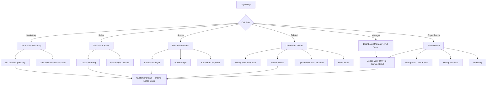
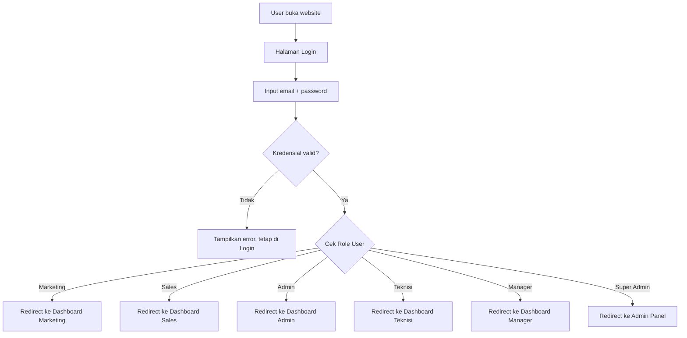
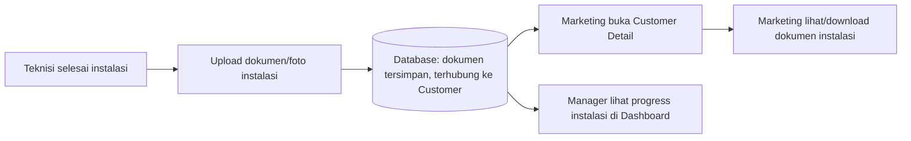
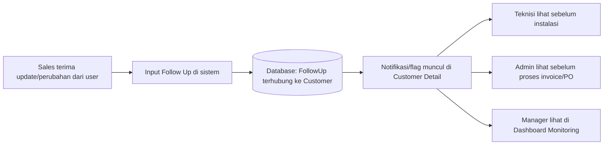

# Frontend Plan — Sistem Operasional Kantor Lintas Divisi

## 0. Asumsi Stack Frontend

Karena backend sudah Laravel + PostgreSQL, asumsi stack frontend di plan ini:

- **Blade** (server-rendered template Laravel) sebagai base.
- **Livewire + Alpine.js** untuk interaktivitas (filter tabel, modal upload, form dinamis) tanpa perlu bikin API terpisah/SPA penuh.
- **TailwindCSS** untuk styling cepat & konsisten.

Kalau ternyata kamu lebih nyaman ke arah Vue/React + Inertia.js (SPA-style di atas Laravel), struktur halaman & flow di bawah tetap berlaku sama — cuma cara render komponennya beda. Beri tahu aku kalau mau di-adjust ke arah itu.

---

## 1. Sitemap / Struktur Navigasi



**Catatan penting:** `Customer Detail` (halaman timeline lintas divisi) adalah halaman paling sering diakses karena ini yang menjawab kebutuhan inti riset kamu — "riwayat lengkap per customer". Semua modul divisi harus punya link/tombol "Lihat Riwayat Customer" yang mengarah ke sini.

---

## 2. Alur Login & Redirect Berbasis Role



---

## 3. Wireframe ASCII — Layout Utama (dipakai semua role)

```
+--------------------------------------------------------------------+
| [Logo]   Sistem Operasional Kantor            (Nama User) [Avatar] |
+----------+-----------------------------------------------------------+
| SIDEBAR  |  BREADCRUMB: Dashboard > Marketing                        |
|          |-----------------------------------------------------------|
| Dashboard|                                                           |
| Lead     |          << KONTEN HALAMAN SESUAI ROLE >>                 |
| Dokumen  |                                                           |
|          |                                                           |
| ------   |                                                           |
| Logout   |                                                           |
+----------+-----------------------------------------------------------+
```

- Sidebar berubah isinya sesuai role (menu Marketing beda dengan Teknisi, dst).
- Manager & Super Admin punya menu tambahan "Semua Divisi" di sidebar.

---

## 4. Wireframe ASCII — Dashboard (Manager / Super Admin, Full View)

```
+--------------------------------------------------------------------+
| Dashboard Monitoring - Semua Divisi                                 |
+--------------------------------------------------------------------+
| Filter: [ Divisi: Semua v ] [ Customer: ______ ] [ Tanggal: __-__ ]  |
+--------------------------------------------------------------------+
|  LEAD MASUK      |  MEETING BULAN INI |  INVOICE OUTSTANDING        |
|      24          |        37          |      Rp 120.000.000         |
+--------------------------------------------------------------------+
|  INSTALASI PROSES|  INSTALASI SELESAI |  PO MENUNGGU PROSES          |
|       6          |        18          |       4                      |
+--------------------------------------------------------------------+
| Progress Tiap Customer (list ringkas)                               |
| ------------------------------------------------------------------ |
| Customer      | Status        | Divisi Terakhir Update | Aksi       |
| ------------------------------------------------------------------ |
| PT Maju Jaya  | Instalasi     | Teknisi (2 hari lalu)   | [Lihat >] |
| CV Sinar Abadi| Meeting       | Sales (kemarin)         | [Lihat >] |
| PT Sumber Ok  | Invoice Bayar | Admin (hari ini)        | [Lihat >] |
+--------------------------------------------------------------------+
```

---

## 5. Wireframe ASCII — Customer Detail (Timeline Lintas Divisi)

Ini halaman paling krusial — dipakai Admin Teknisi (primary persona) tiap hari.

```
+--------------------------------------------------------------------+
| < Kembali        PT Maju Jaya - Riwayat Lengkap Customer            |
+--------------------------------------------------------------------+
| Info Dasar: Kontak | No HP | Alamat | Status: [Instalasi Berjalan]  |
+--------------------------------------------------------------------+
| Filter Timeline: [x] Marketing [x] Sales [x] Teknisi [x] Admin      |
+--------------------------------------------------------------------+
|  o  [Marketing] Lead masuk dicatat            - 3 Jan 2026          |
|  |                                                                  |
|  o  [Sales] Meeting kebutuhan awal            - 10 Jan 2026         |
|  |    Kebutuhan: ... | Sistem existing: ...                        |
|  |                                                                  |
|  o  [Sales] Follow up: ada perubahan spek      - 15 Jan 2026        |
|  |                                                                  |
|  o  [Teknisi] Survey pre-instalasi selesai     - 20 Jan 2026        |
|  |                                                                  |
|  o  [Admin] PO diterima                        - 22 Jan 2026        |
|  |                                                                  |
|  o  [Teknisi] Instalasi + Upload Dokumentasi   - 25 Jan 2026        |
|  |    [Lihat Dokumen] [Lihat Foto]                                  |
|  |                                                                  |
|  o  [Teknisi] BAST diterbitkan                 - 25 Jan 2026        |
|  |                                                                  |
|  o  [Admin] Invoice terbit / Payment diterima  - 28 Jan 2026        |
+--------------------------------------------------------------------+
```

---

## 6. Wireframe ASCII — Tracker Meeting Customer (Sales)

```
+--------------------------------------------------------------------+
| Tracker Meeting Customer                        [+ Catat Meeting]   |
+--------------------------------------------------------------------+
| Cari customer: [______________]   Filter tanggal: [__-__]           |
+--------------------------------------------------------------------+
| Customer      | Tanggal   | Kebutuhan (ringkas)     | Aksi          |
| -------------------------------------------------------------------|
| PT Maju Jaya  | 10 Jan 26 | Butuh sistem CCTV baru  | [Detail][Edit]|
| CV Sinar Abadi| 12 Jan 26 | Keluhan koneksi lambat  | [Detail][Edit]|
+--------------------------------------------------------------------+

>> FORM "Catat Meeting" (modal/halaman baru) <<
+--------------------------------------------------------------------+
| Customer:        [ dropdown/search_______________ ]                |
| Tanggal Meeting:  [ __-__-____ ]                                    |
| Peserta:          [_____________________________]                  |
| Kebutuhan User:   [ textarea________________________ ]             |
| Keluhan User:     [ textarea________________________ ]             |
| Sistem Existing:  [ textarea________________________ ]             |
| Catatan Lain:     [ textarea________________________ ]             |
|                                          [Batal]  [Simpan]           |
+--------------------------------------------------------------------+
```

---

## 7. Wireframe ASCII — Invoice & PO Manager (Admin)

```
+--------------------------------------------------------------------+
| Invoice & PO Manager        [Tab: Invoice] [Tab: PO] [Tab: Payment]  |
+--------------------------------------------------------------------+
| TAB: INVOICE                                    [+ Buat Invoice]    |
| ---------------------------------------------------------------    |
| No Invoice | Customer     | Nominal      | Status     | Aksi        |
| ---------------------------------------------------------------    |
| INV-0012   | PT Maju Jaya | Rp 15.000.000| Belum Bayar| [Detail]    |
| INV-0011   | CV Sinar     | Rp  8.000.000| Lunas      | [Detail]    |
+--------------------------------------------------------------------+

>> TAB: PO <<
+--------------------------------------------------------------------+
| No PO      | Customer     | Item             | Status    | Aksi     |
| PO-2026-04 | PT Maju Jaya | CCTV 8 titik     | Diproses  | [Detail] |
+--------------------------------------------------------------------+

>> TAB: PAYMENT <<
+--------------------------------------------------------------------+
| Invoice Terkait | Tanggal Bayar | Nominal       | Bukti Transfer    |
| INV-0011        | 20 Jan 2026   | Rp 8.000.000  | [Lihat File]      |
+--------------------------------------------------------------------+
```

---

## 8. Wireframe ASCII — Instalasi & Upload Dokumen (Teknisi)

```
+--------------------------------------------------------------------+
| Instalasi - PT Maju Jaya                                            |
+--------------------------------------------------------------------+
| Tanggal Instalasi: [__-__-____]                                     |
| Teknisi Bertugas:  [ dropdown multi-select_______ ]                 |
| Item Diinstal:     [ textarea___________________ ]                  |
| Kendala Lapangan:  [ textarea___________________ ]                  |
+--------------------------------------------------------------------+
| Upload Dokumen Instalasi                                             |
| [ Drag & drop file / Pilih File ]   [foto1.jpg] [foto2.jpg] [x]      |
+--------------------------------------------------------------------+
|                                          [Simpan] [Lanjut ke BAST]   |
+--------------------------------------------------------------------+
```

---

## 9. Wireframe ASCII — Admin Panel (Super Admin)

```
+--------------------------------------------------------------------+
| Admin Panel (Super Admin)                                           |
+----------+-----------------------------------------------------------+
| Menu:    |  Manajemen User                          [+ Tambah User]  |
| - User & |  ------------------------------------------------------  |
|   Role   |  Nama       | Email          | Role      | Status | Aksi  |
| - Fitur  |  Budi       | budi@ktr.com   | Teknisi   | Aktif  | [Edit]|
| - Audit  |  Sari       | sari@ktr.com   | Sales     | Aktif  | [Edit]|
|   Log    |  ------------------------------------------------------  |
+----------+-----------------------------------------------------------+
```

---

## 10. Alur Interaksi Kunci: Upload Dokumen Instalasi → Terlihat di Marketing



---

## 11. Alur Interaksi Kunci: Follow Up Sales Terlihat Lintas Divisi



---

## 12. Komponen UI Reusable (agar frontend konsisten & tidak berantakan)

| Komponen | Dipakai di | Catatan |
|---|---|---|
| `StatusBadge` | Lead, Invoice, PO, Instalasi | Warna beda per status (mis. hijau=lunas, kuning=proses, merah=overdue) |
| `TimelineItem` | Customer Detail | Reusable card untuk tiap event lintas divisi |
| `DataTable` (dengan search & filter) | Semua list (Lead, Meeting, Invoice, PO) | Satu komponen tabel generik dipakai ulang |
| `FileUploadCard` | Upload Dokumen Instalasi, Bukti Bayar | Drag & drop + preview |
| `RoleGuardedMenu` | Sidebar | Render menu sesuai role dari middleware/permission |
| `CustomerSearchDropdown` | Semua form yang butuh pilih customer | Autocomplete customer by nama |

Struktur folder Blade/Livewire yang disarankan supaya nggak "berantakan lagi":
```
resources/views/
├── layouts/
│   └── app.blade.php
├── components/
│   ├── status-badge.blade.php
│   ├── timeline-item.blade.php
│   └── data-table.blade.php
├── marketing/
├── sales/
├── admin/
├── teknisi/
├── manager/
└── super-admin/
```

---

## 13. UX Tambahan — Scoped Access per Divisi + Cross-Division Read-Only

Prinsip inti: **setiap user login hanya "hidup" di divisinya sendiri** (sidebar, menu, submenu, CRUD penuh), tapi tetap bisa **melihat ringkasan divisi lain dalam mode read-only**. Manager & Super Admin tetap full monitoring semua divisi seperti rancangan awal.

### 13.1 Sidebar dinamis per role

```
+------------------+
| SALES            |   <- label divisi user, biar jelas dia login sebagai apa
+------------------+
| Dashboard         |
| Tracker Meeting   |
|   > Semua Meeting |
|   > Meeting Saya  |
| Follow Up         |
+------------------+
| LIHAT DIVISI LAIN |   <- section terpisah, styling redup/berbeda
|   Marketing (view)|
|   Admin (view)    |
|   Teknisi (view)  |
+------------------+
```

Menu "milik sendiri" (bisa CRUD) dan menu "lihat divisi lain" (read-only) dipisahkan secara visual (warna aktif vs redup, ikon 👁 untuk view-only) supaya user tidak salah kira bisa edit data divisi lain.

### 13.2 Cross-division view = ringkasan, bukan halaman detail penuh

```
+--------------------------------------------------------------------+
| Marketing (Read-Only)                              [Kembali]        |
+--------------------------------------------------------------------+
| Total Lead Bulan Ini: 24    Lead Baru Minggu Ini: 5                  |
+--------------------------------------------------------------------+
| Customer      | Status Lead     | Update Terakhir                   |
| PT Maju Jaya  | Deal            | 3 hari lalu                       |
+--------------------------------------------------------------------+
| * Untuk detail lengkap, buka Customer Detail                        |
+--------------------------------------------------------------------+
```

Klik "Marketing (view)" tidak membuka halaman List Lead lengkap dengan tombol edit/hapus — cukup versi ringkas. Detail lengkap tetap diarahkan ke satu tempat: **Customer Detail Timeline**.

### 13.3 Global search customer di topbar

```
+--------------------------------------------------------------------+
| [Logo]    [ 🔍 Cari customer... ]              (Nama User) [Avatar] |
+--------------------------------------------------------------------+
```

Tersedia untuk semua role, hasil klik langsung menuju Customer Detail Timeline (bukan ke modul spesifik divisi) — supaya Admin Teknisi (primary persona) bisa cepat menemukan histori tanpa perlu tahu ada di menu mana.

### 13.4 Badge notifikasi relevan per role

- Sales → badge merah kalau ada Follow Up yang belum ditindaklanjuti.
- Admin → badge kalau ada invoice mendekati jatuh tempo.
- Teknisi → badge kalau ada instalasi terjadwal hari ini.
- Manager & Super Admin → badge gabungan dari semua divisi (untuk monitoring).

### 13.5 Halaman permission-denied yang informatif

Kalau user mengakses URL di luar haknya (mis. Sales membuka `/admin/invoice/edit`):

```
+--------------------------------------------------------------------+
|              🔒 Kamu tidak punya akses ke halaman ini               |
|         Halaman ini khusus untuk divisi Admin.                      |
|                  [Kembali ke Dashboard Sales]                       |
+--------------------------------------------------------------------+
```

### 13.6 Aksen warna per divisi (opsional)

Satu warna khas tiap divisi (mis. Marketing=biru, Sales=hijau, Admin=oranye, Teknisi=ungu, Manager=abu netral), dipakai di sidebar aktif, badge status, avatar border. Efeknya di Customer Detail Timeline (yang isinya campur semua divisi), user bisa langsung scan visual sumber tiap event tanpa baca label satu-satu.

### 13.7 Skema permission backend (2 lapis, via `spatie/laravel-permission`)

| Permission | Contoh | Siapa yang dapat |
|---|---|---|
| `view-{divisi}` | `view-marketing`, `view-admin` | Semua role (untuk mode read-only lintas divisi) |
| `manage-{divisi}` | `manage-sales`, `manage-teknisi` | Hanya role divisi terkait |
| `manage-*` (semua) | - | Super Admin |
| `view-*` (semua) | - | Manager, Super Admin |

Middleware route Laravel cukup cek dua permission ini untuk decide: tampilkan versi CRUD penuh, versi read-only ringkas, atau tolak akses sama sekali.

## 14. Next Steps

1. Konfirmasi: tetap Blade + Livewire, atau mau ke arah Vue/Inertia (SPA)?
2. Kalau oke, aku bisa lanjut bantu breakdown ke component-level (props/state tiap komponen) atau langsung bikin starter code untuk salah satu halaman prioritas (misal Customer Detail Timeline, karena ini fitur inti).
